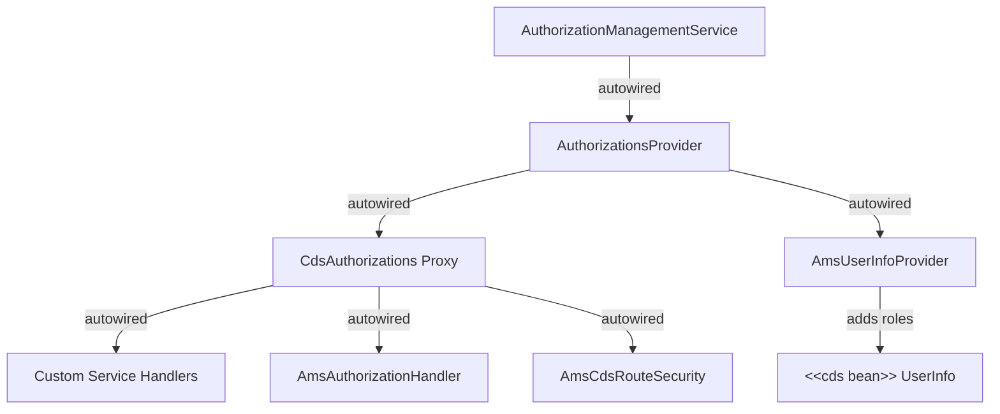

# cap-ams

This `cap-ams` module integrates AMS with CAP Java applications.

See the [CAP Integration](/CAP/Basics) documentation for the relationship between cds annotations and enforcement with authorization policies.

## Installation

Use the Spring Boot starter module:

```xml
<dependency>
    <groupId>com.sap.cloud.security.ams</groupId>
    <artifactId>spring-boot-starter-cap-ams</artifactId>
</dependency>
```

::: tip
For non-Spring-Boot CAP Java applications, please open a support ticket to discuss integration options. The `cap-ams` module does not require Spring Boot, but it is tough to provide a flexible starter with replaceable, configurable bootstrapping without Spring's dependency injection and configuration features.
:::

## Architecture

### Auto-Configured Beans

The starter creates the following beans:




| Bean | Role |
|------|------|
| `AuthorizationManagementService` | Core AMS client created from the SAP Identity Service binding |
| `AuthorizationsProvider<CdsAuthorizations>` | Builds and (weakly) caches user authorizations based on UserInfo and SecurityContext (**Customization of library typically happens via this interface**)|
| `CdsAuthorizations` (Proxy) | Singleton for performing authorization checks in the context of the current user's authorizations |
| `AmsUserInfoProvider` (Internal) | CAP `UserInfoProvider` implementation that enriches `UserInfo` with cds roles granted by policies |
| `AmsAuthorizationHandler` (Internal) | CAP event handler that injects instance-based WHERE conditions into `cds restrictions` in case of policy conditions for the computed role(s) |
| `AmsCdsRouteSecurity` | Provides route-level authorization filters outside CAP framework |

### CdsAuthorizations

The `CdsAuthorizations` **bean** is a *singleton JDK Dynamic Proxy* that implements the `CdsAuthorizations` **interface**. Every method invocation on the proxy resolves the current user's authorizations with the `AuthorizationsProvider` bean based on the thread-local `RequestContext` and the corresponding `UserInfo`. Additional information is obtained from the thread-local `SecurityContext` if necessary, e.g. whether an SCI or XSUAA token has been used for authentication. This proxy mechanism makes authorization checks against the `CdsAuthorizations` interface very convenient, even though internally one instance of `CdsAuthorizations` is created and cached per request context.


::: warning
Avoid using the `CdsAuthorizations` bean for custom authorization checks unless necessary. It is best practice to use a declarative approach with cds annotations to let the AMS plugin handle role computation and filter generation while CAP handles the actual authorization enforcement based on the result.
:::

#### Interface

The `CdsAuthorizations` interface extends the generic `Authorizations` interface with additional utility methods specific for the [role-based](/CAP/Basics.html#role-policies) CAP integration.

It can be used in any Spring context, e.g. custom service handlers, to check for authorizations if the annotation-based approach via the cds model is not sufficient:

```java
import com.sap.cloud.security.ams.cap.api.CdsAuthorizations;
import com.sap.cloud.security.ams.api.Decision;
import com.sap.cloud.security.ams.api.expression.AttributeName;

@Component
public class BookServiceHandler implements EventHandler {

    @Autowired
    private CdsAuthorizations cdsAuthorizations; // singleton proxy — resolves per request

    // Showcases a custom service handler that manually checks role permissions for a single-entity access. The example may not showcase best practices, but it serves to illustrate how to use the CdsAuthorizations proxy in custom code if necessary.
    @On(event = CdsService.EVENT_READ, entity = Books_.CDS_NAME)
    public void onReadBook(CdsReadEventContext context) {
        // ... resolve book entity from context ...

        // Check if the user may use the Editor role for this specific book
        Decision decision = cdsAuthorizations.computeRoleFilters(
            "Editor",
            Set.of(), // we expect no unresolved attributes in the result — our input grounds all attributes
            Map.of(
                AttributeName.of("country"), book.getCountry(),
                AttributeName.of("genre"), book.getGenre()
            )
        );

        if (decision.isDenied()) {
            throw new ServiceException(ErrorStatuses.FORBIDDEN, "Access denied");
        }

        // decision.isGranted() — user may use Editor role for this book
        // !decision.isDenied() && !decision.isGranted() — policy condition could not be evaluated to boolean with given input -> unexpected behavior that requires trouble-shooting
    }
}
```

#### Caching Implementation

- The proxy uses `RequestContext.getCurrent(cdsRuntime)` to obtain the current request context and corresponding `UserInfo`. Then, it retrieves the current user's authorizations from the `AuthorizationsProvider` bean, which computes the authorizations based on the `UserInfo` and `SecurityContext`.

- `SciAuthorizationsProvider`, the default implementation of `AuthorizationsProvider`, caches computed authorizations in a `WeakHashMap` keyed by the `RequestContext` lifecycle reference — so within a single request, authorizations are resolved only once.
- The `AmsUserInfoProvider` runs earlier (during `RequestContext` construction) to add AMS roles to `UserInfo`. To prevent a recursive stack overflow, it does not compute user roles with the `CdsAuthorizations` proxy (which would request the `UserInfo` again - forming a cyclic dependency). Instead, it presents the previous `UserInfo` to the `AuthorizationsProvider`.

### AmsCdsRouteSecurity

`AmsCdsRouteSecurity` provides Spring Security `AuthorizationManager` instances for route-level role checks with Spring Security outside the CAP framework. 

::: warning
Avoid using the `AmsCdsRouteSecurity` bean for custom authorization checks unless necessary. It is recommended to use a declarative approach with cds annotations to enforce authorization of application logic. The bean is meant for use cases where this is not practical.
:::

`AmsCdsRouteSecurity` operates on the `CdsAuthorizations` proxy and offers two semantics:

- **`checkRole(role)`** — grants access only if the role is unconditionally granted (no conditions). Rejects conditional and denied decisions.
- **`precheckRole(role)`** — grants access if the role is not definitely denied (i.e., granted or conditional). Use this only when the service layer implements an additional contextual authorization check that enforces the filter conditions.

Multi-role variants `checkAnyRole`, `checkAllRoles`, `precheckAnyRole`, and `precheckAllRoles` combine multiple role checks with OR/AND semantics respectively.

```java
@Configuration
public class SecurityConfiguration {

    @Bean
    public SecurityFilterChain filterChain(HttpSecurity http, AmsCdsRouteSecurity via) throws Exception {
        http.authorizeHttpRequests(authz -> authz
                .requestMatchers("/actuator/health").permitAll()
                // Custom REST endpoint outside CAP — requires unconditional Admin role
                .requestMatchers("/api/admin/**").access(via.checkRole("Admin"))
                .anyRequest().denyAll()
            )
            .oauth2ResourceServer(oauth2 -> oauth2.jwt(Customizer.withDefaults()));

        return http.build();
    }
}
```

::: tip
The `.oauth2ResourceServer(oauth2 -> oauth2.jwt(Customizer.withDefaults()))` call configures Spring Security to validate incoming Bearer tokens as JWTs. This is required for any application that receives OAuth2 tokens (from SAP Identity Service / IAS). Without it, Spring Security will not extract the authenticated principal from the `Authorization` header, and no `SecurityContext` will be available for downstream AMS checks.

CAP Java applications that use `cds-starter-cloudfoundry` or `cds-starter-k8s` typically get this configured automatically. You only need to declare it explicitly if you provide a custom `SecurityFilterChain` bean (which overrides the auto-configured one).
:::

## Configuration Properties

Configure the starter in `application.yaml` using CDS properties:

```yaml
cds:
  security:
    authorization:
      ams:
        edge-service:
          url: http://localhost:8080   # Edge service URL (optional)
        bundle-loader:
          polling-interval: 20000      # Bundle update polling interval in ms (default: 20000)
          initial-retry-delay: 1000    # Initial retry delay after failure in ms (default: 1000)
          max-retry-delay: 20000       # Maximum retry delay in ms (default: 20000)
          retry-delay-factor: 2        # Exponential backoff factor (default: 2)
        features:
          generateExists: true         # Generate EXISTS predicates for filter attributes behind 1:N associations (default: true)
```
